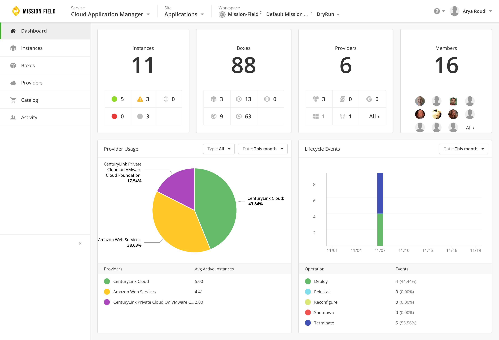
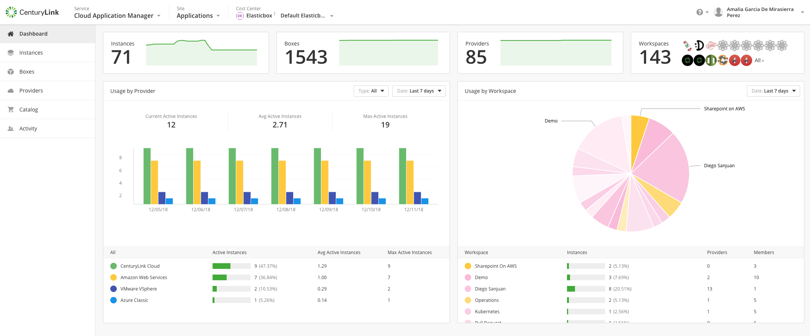
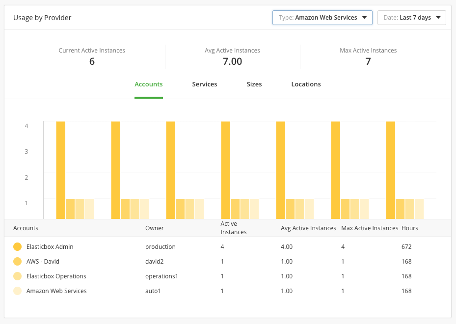
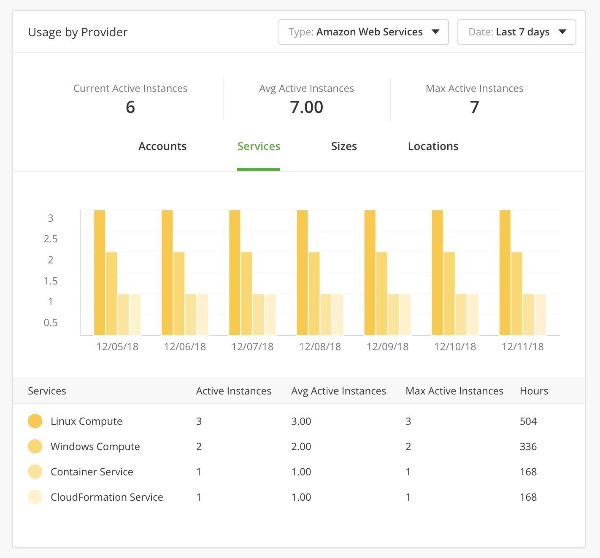
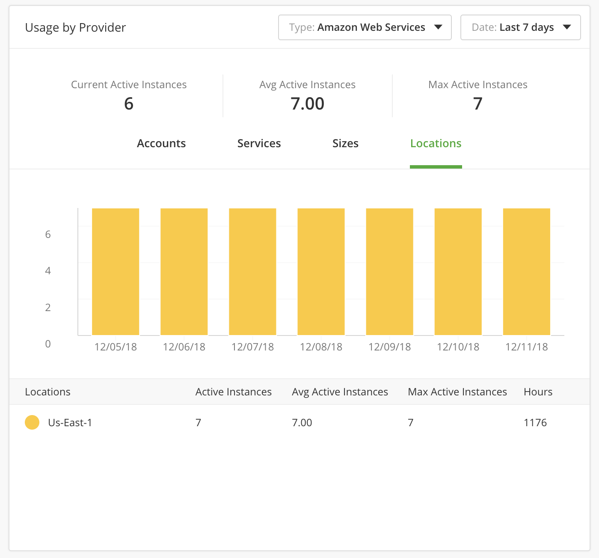

{{{
"title": "Get Control and Insights with Dashboard ",
"date": "12-14-2018",
"author": "Arya Roudi and Amalia García de Mirasierra",
"keywords":["cam dashboard", "dashboard", "dashboard report"],
"attachments": [],
"contentIsHTML": false
}}}

**In this article:**

* [Overview](#overview)
* [Audience](#audience)
* [Prerequisites](#prerequisites)
* [Workspace scope](#workspace-scope)
* [Cost Center scope](#cost-center-scope)
* [Organization scope](#organization-scope)

### Overview

The Dashboard shows cloud costs and resource usage in public and private clouds. It includes public clouds like AWS, Google Cloud, Azure and private clouds like VMware vCenter, VMware vCloud Director, and SoftLayer. It also helps you make budget-friendly decisions and curb costs through cost center budgeting.

Depending on the scope, different views and different data can be shown.

### Audience

All users with Cloud Application Manager access (for workspace scope).
Cloud Application Manager users with cost center administration access or organization administration access (for cost center scope).
Cloud Application Manager users with organization administration access (for organization scope).

### Prerequisites

* Access to the dashboard of Cloud Application Manager, [Applications site](https://cam.ctl.io/#/dashboard).

#### Workspace scope

In the workspace scope dashboard, the information shown is related to the use of resources made by the owner and/or shared users.

At the top, there are four boxes that contain the following information :

* **Instances** - Total number of instances in this workspace and split by status.
* **Boxes** - Total number of boxes in the workspace and their types.
* **Providers** - Total number of providers defined in the workspace and divided by type.
* **Members** - Total number of members that have access to this workspace.

At the bottom, there are two charts which describe the use of providers and the lifecycle events. Both can be filtered by a date range. In regards to the lifecycle events, these can also be filtered by provider type.

### Cost Center scope

In this scope, the information showed is focused on resources and provider usage.
At the top, there are four boxes with the information described below:

* **Instances** - Total number of instances inside of the cost center with the line chart of the last month.
* **Boxes** - Total number of boxes and the line chart of the last month.
* **Providers** - Total number defined in the cost center with the line chart of the last month.
* **Workspaces** - Total number of workspaces in this cost center.

At the bottom, as well as it happens with the workspace scope, there are two charts, one with the Usage by provider and the other with the Usage by workspace. Both can be filtered by date range.

In **Provider Usage** chart, the data that show is about the period selected. The day of today doesn't take into account. The information to show is:

On top of the graph you can find:
1. The number of the actives instances at this moment with the providers detect in this period.
*  The sum of the average of the actives instances for each provider type.
*  The sum of the maximum of the actives instances for each provider type.

Below of the graph you can find:
* Types of provider used in period.
* The number of the actives instances for each provider type.
* The average of the actives instances for each provider type.
* The maximum number of the actives instances for each provider type.

 The Provider Usage chart can also be filtered by provider type. If you filter by provider type, the chart shows the information organized in tabs by account, services, sizes or locations.

In the provider usage chart, __**accounts**__ tab displays the following:

On top of the graph you can find:
1. The number of the actives instances at this moment with the selected provider in this period.
*  The sum of the average of the actives instances for selected provider.
*  The sum of the maximum of the actives instances for selected provider.

Below of the graph you can find:
* Each accounts of the provider type selected.
* Owner of each account.
* The number of the actives instances for each account of the selected provider type.
* The average of the actives instances for each account of the selected provider type.
* The maximum number of the actives instances for each account of the selected provider type.
* The consumed hours by each account of the selected provider type.

In the provider usage chart, __**services**__ tab displays the following:

On top of the graph you can find:
1. The number of the actives instances at this moment with the selected provider in this period.
*  The sum of the average of the actives instances for selected provider.
*  The sum of the maximum of the actives instances for selected provider.

Below of the graph you can find:
* Each service of the provider type selected.
* The number of the actives instances for each service of the selected provider type.
* The average of the actives instances for each service of the selected provider type.
* The maximum number of the actives instances for each service of the selected provider type.
* The consumed hours by each service of the selected provider type.

In the provider usage chart, __**sizes**__ tab displays the following:

On top of the graph you can find:
1. The number of the actives instances at this moment with the selected provider in this period.
*  The sum of the average of the actives instances for selected provider.
*  The sum of the maximum of the actives instances for selected provider..

Below of the graph you can find:
* Each size of the provider type selected.
* The number of the actives instances for each size of the selected provider type.
* The average of the actives instances for each size of the selected provider type.
* The maximum number of the actives instances for each size of the selected provider type.
* The consumed hours by each size of the selected provider type.

In the provider usage chart, __**locations**__ tab displays the following:

On top of the graph you can find:
1. The number of the actives instances at this moment with the selected provider in this period.
*  The sum of the average of the actives instances for selected provider.
*  The sum of the maximum of the actives instances for selected provider.

Below of the graph you can find:
* Each location of the provider type selected.
* The number of the actives instances for each location of the selected provider type.
* The average of the actives instances for each location of the selected provider type.
* The maximum number of the actives instances for each location of the selected provider type.
* The consumed hours by each location of the selected provider type.

### Organization scope

In this scope, the information showed is focused on resources and usage by provider and cost center.
At the top, there are five boxes with the information described above:

* **Instances** - Total number of instances inside of the organization with the line chart of the last month.
* **Boxes** - Total number of boxes and the line chart of the last month.
* **Providers** - Total number defined in the organization with the line chart of the last month.
* **Workspaces** - Total number of workspaces in this organization.
* **Cost Centers** - Total number of cost centers in the organization.

At the bottom, there are two charts. One of them with the same information and behavior that the provider usage chart of the cost center scope but for the organization scope, and the second one with the usage by cost center, shows the usage of each cost center by percentage.

### Contacting Cloud Application Manager Support

We’re sorry you’re having an issue in [Cloud Application Manager](https://www.ctl.io/cloud-application-manager/). Please review the [troubleshooting tips](../Troubleshooting/troubleshooting-tips.md), or contact [Cloud Application Manager support](mailto:incident@CenturyLink.com) with details and screenshots where possible.

For issues related to API calls, send the request body along with details related to the issue.

In the case of a box error, share the box in the workspace that your organization and Cloud Application Manager can access and attach the logs.
* Linux: SSH and locate the log at /var/log/elasticbox/elasticbox-agent.log
* Windows: RDP into the instance to locate the log at ProgramDataElasticBoxLogselasticbox-agent.log
